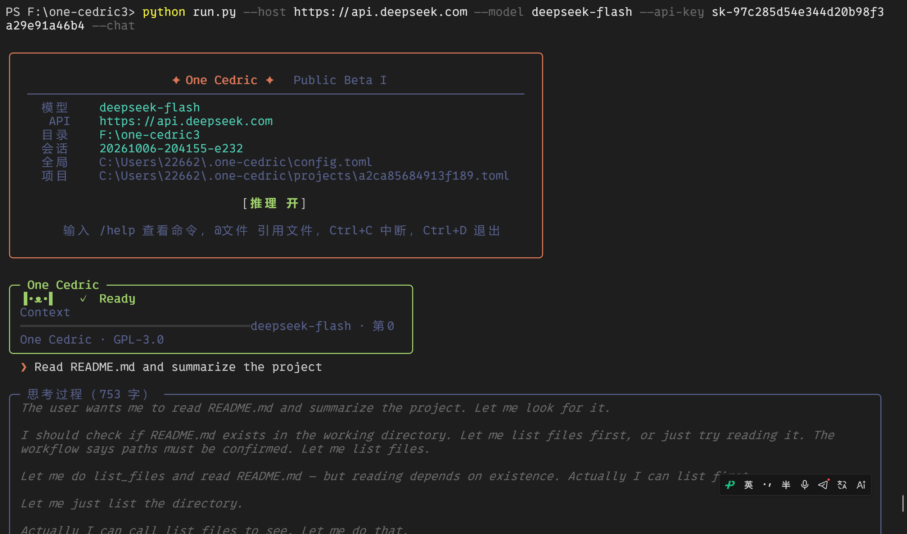
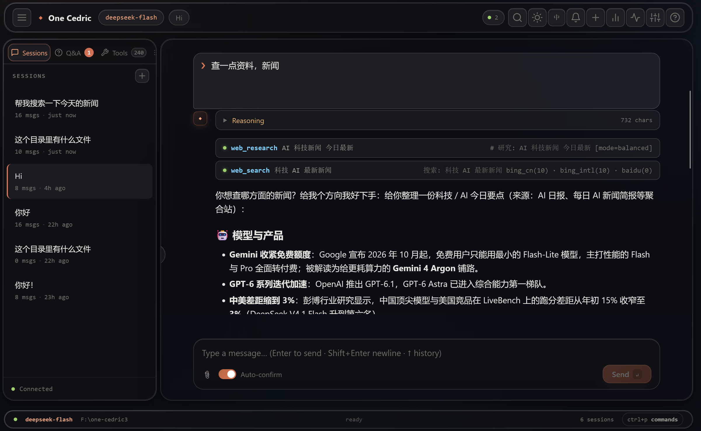

# One Cedric

> **An AI agent for beginners**
>
>  — built by a high school student
>
> @[Aoan2011](https://github.com/Aoan2011)
>
> .
> License: **GPL-3.0**
>
>  · Version: **Public Beta I**

> ***Note***: This repo is partly generated by AI.

[](https://python.org)
[](https://textual.textualize.io)
[](LICENSE)


One Cedric is a local, file-smart AI agent that gives you **two frontends** — a terminal **CLI** and a Liquid Glass **WebUI** — over the same agent core. It connects to any **OpenAI-compatible** model provider (Ollama, DeepSeek, Kimi, ChatGPT, and more) and ships with **240+ built-in tools**: file operations, code search, a sandboxed terminal, web fetching, Office documents, databases, LSP analysis, and more. It is designed to be easy enough for a beginner to run in five minutes, while still being powerful enough to automate real work in your folders.
> **One Editor Lite** is part of **One Editor** family, MIT license. 



***

## 1. Installation

### Requirements


* **Python 3.10 or newer** (check with `python --version`)

* Git (recommended; enables snapshots & rollback)

* An LLM backend — one of:


  * **Ollama** (free, local): install from [https://ollama.com](https://ollama.com), then

    `ollama pull deepseek-flash`

  * **DeepSeek / Kimi / OpenAI / any OpenAI-compatible API**: just set `host` and

    `api_key`

### Install


```
# 1. Clone the repository
git clone https://github.com/Aoan2011/One-Cedric.git
cd One-Cedric

# 2. Install dependencies
pip install -r requirements.txt
```

> Missing optional packages are not fatal — the 
>
> **Diagnose**
>
>  screen lists exactly what is missing and how to install it (see [Troubleshooting](#6-troubleshooting--diagnose)).

### Verify it runs


```
python -m one_cedric --version    # project info + version
```


***

## 2. Quick Start

### Terminal (CLI)


```
# Launch the menu-driven CLI
python -m one_cedric

# Skip the menu and jump straight into chat
python -m one_cedric --chat
```

Type your first request, for example:


```
Read README.md and summarize the project.
```

The agent reads the file, summarizes it, and answers. Type `/help` at any time for

the command list, and `/exit` to quit.

### Web UI (Gateway)


```
python -m one_cedric --gateway
# then open http://127.0.0.1:2043 in your browser
```

You get a Liquid Glass chat interface: session sidebar, message tree, ask threads, tool output with syntax highlighting, an in-composer think-level selector, embedded Settings/Stats/Cron/Dream panels, a sandbox-terminal switch, a Diagnose panel, and a Custom Tools manager.

> When running on a remote machine, use 
>
> `--host 0.0.0.0` and  `--token <secret>` to protect the UI.

### 2.1 Uploading files vs. `@` references

One Cedric has **two different ways** to give the agent file content:

| | Upload (send now) | `@path` reference (attach on send) |
| --- | --- | --- |
| What it does | Immediately sends the file content to the agent as a message — analysis starts right away | Expands `@path` into file content **when you send your question**; content travels with that message |
| CLI | `/upload src/main.py README.md` (multiple paths) | Type `@src/main.py` anywhere in your message |
| WebUI | Click the **📎** button, drag & drop onto the window, or `Ctrl+V` paste — files are uploaded and a `@path` reference is auto-inserted into the input box | Type `@path` in the composer |
| When to use | You want the agent to **look at the material first**, then discuss it | The file is **part of a larger question** you are about to ask |
| Side effects | Processing starts immediately | Nothing happens until you send the message |

The `@` syntax is the same in both frontends:

```
@README.md              attach the whole file
@src/main.py#L10-L20    attach lines 10–20 only
@src/                   attach a directory listing
@src/**                 attach a recursive directory listing
```

> Tip: in the WebUI, uploading through 📎 / drag & drop / `Ctrl+V` does **not**
> send the message — it uploads the file and inserts an `@path` reference, so you
> can still type your question first. In the CLI, `/upload` **does** trigger the
> agent immediately; use `@path` inside a normal question instead.


***

## 3. Configuration

Configuration lives in TOML files:


| File                                 | Purpose                                                      |
| ------------------------------------ | ------------------------------------------------------------ |
| `~/.one-cedric/config.toml`          | Global defaults                                              |
| `~/.one-cedric/projects/<hash>.toml` | Per-project overrides (auto-generated per working directory) |
| `~/.one-cedric/integrations.json`    | MCP servers, hooks, custom tools                             |

Minimal `config.toml`:


```
[default]
model = "deepseek-flash"         # model name
host = "http://localhost:11434"  # Ollama by default; or https://api.deepseek.com
api_key = ""                     # leave empty for Ollama
think_level = "medium"           # minimal | low | medium | max | xhigh | ultra
mode = "workspace"               # workspace | fullaccess | ask
sandbox_terminal = true          # sandbox the shell tool (recommended)
allow_arbitrary_shell = false    # require whitelist for bash
```

Key settings:


* **mode** — `workspace` (writes need your confirmation), `fullaccess` (no

  confirmation), `ask` (let the agent ask you questions when unsure).

* **sandbox\_terminal** — when on, unknown shell commands are blocked and sensitive

  environment variables are scrubbed before any command runs.

* **think\_level** — how much reasoning effort the model spends.

You can also change most settings from inside the app: `/model`, `/think`, `/mode`

in the CLI; the **Settings** page in the WebUI.


***

## 4. Command Line

### Global options


```
python -m one_cedric [options]

--chat                 jump straight into the chat REPL
--gateway / --gw       start the WebUI gateway (default http://127.0.0.1:2043)
--license              print the GPL-3.0 license text and exit
--version              print version and project info
--host <addr>          gateway bind address (default 127.0.0.1)
--port <port>          gateway port (default 2043)
--token <secret>       require a Bearer token on the gateway
--sandbox-terminal     force the shell sandbox on
--no-sandbox-terminal  force the shell sandbox off
```

### CLI slash commands


| Command                                                    | What it does                                                    |
| ---------------------------------------------------------- | --------------------------------------------------------------- |
| `/help`                                                    | Show help                                                       |
| `/new` `/clear` `/sessions` `/resume` `/save-as` `/export` | Sessions                                                        |
| `/model` `/think` `/reasoning` `/mode`                     | Model & thinking settings                                       |
| `/shell on\|off`                                           | Allow arbitrary shell commands                                  |
| `/sandbox on\|off`                                         | Toggle the sandbox terminal                                     |
| `/tools [list\|install\|uninstall\|gen]`                   | Tool manager & custom tools                                     |
| `/plan` `/todos`                                           | Plan mode & task list                                           |
| `/undo` `/rollback` `/snapshots`                           | Revert file changes                                             |
| `/diff [n]`                                                | Show a colorized diff (green/red/yellow with highlighted lines) |
| `/history` `/tag` `/untag`                                 | File history & tags                                             |
| `/stats` `/audit` `/cost`                                  | Statistics & costs                                              |
| `/mem` `/cron` `/asks`                                     | Memory, cron jobs, ask threads                                  |
| `/config` `/save-config` `/profile` `/lang`                | Configuration & language                                        |

### WebUI slash commands

In the WebUI composer, type: `/new`, `/clear`, `/search`, `/export`, `/theme`,

`/lang`, `/settings`, `/sidebar`, `/help`, `/stats`, `/model`, `/think`,

`/sessions`, `/tools`, `/asks`, `/sandbox`, `/diagnose`.


***

## 5. Tools

### Built-in tools (240+)

One Cedric ships with a large tool set, grouped by category:


| Category     | Examples                                                                  |
| ------------ | ------------------------------------------------------------------------- |
| Files        | `read_file`, `write_file`, `edit_file`, `glob`, `grep_regex`, `file_info` |
| Web          | `web_fetch`, `web_search`, `web_research`, `http_request`                 |
| Terminal     | `bash`, `bash_bg` (sandboxed by default)                                  |
| Data         | `sqlite`, `csv_query`, `json_query`, `postgres_query`                     |
| Office       | Word / PPT / Excel / PDF read & convert                                   |
| Code help    | LSP hover / definition / references / symbols / diagnostics               |
| Media & more | image, audio, video, QR code, archive, email, weather …                   |

Browse and toggle them from the CLI (`/tools`) or the WebUI **Tools** sidebar tab.

### Custom tools (install / uninstall / AI-generate)

You are not limited to the built-ins:


* **Install a command-line tool** — any executable that reads a JSON object from

  stdin and writes its result to stdout can become a tool:


```
/tools install <name> <command...>
# example: /tools install weekday python C:/tools/weekday.py
```


* **Uninstall** — `/tools uninstall <name>`

* **List** — `/tools list`

* **AI-generate a tool** — describe what you want and One Cedric writes the Python

  script + JSON schema for you:


```
/tools gen a read-only tool that returns the CPU temperature
```

Generated tools are stored in `~/.one-cedric/custom_tools/<name>.py` and registered

as `custom__<name>`. The same actions are available in the WebUI under

**Tools → Custom**.


* **MCP servers** — connect to any Model Context Protocol stdio server; its remote tools appear automatically as `mcp__<server>__<tool>`.


### Third-party skills from `~/.agents/skills` (read-only)

One Cedric can also read documentation-style skills that other agent runtimes

install into `~/.agents/skills/<name>/SKILL.md`. This is strictly **read-only**:

your data directory stays in `~/.one-cedric/` and nothing in `~/.agents` is ever

modified. When skills are detected, a single `agents_skill` tool is exposed to the

model — call it without a name to enumerate the available skills, then pass a

`name` to read the full `SKILL.md` instructions and act on them (for example by

invoking the CLI the skill relies on). You can disable it by setting

`agents_skills.enabled = false` in `~/.one-cedric/integrations.json`, and the

CLI/WebUI Diagnose panels both show how many skills were loaded.

***

## 6. Troubleshooting & Diagnose


* **CLI**: main menu → **Diagnose**.

* **WebUI**: press the ⚡ button in the top bar, or type `/diagnose`.

The Diagnose panel checks:


* core & optional Python packages (`fastapi`, `rich`, `requests`, …)

* Python & Git availability

* LSP configuration readiness

* registered tool count, access mode, sandbox-terminal state

If something is missing it tells you the exact `pip install` command.


***

## 7. WebUI

Start it with `python -m one_cedric --gateway`.


* **Liquid Glass design** — frosted panels, glass buttons, acrylic strength

  (off/low/medium/high), light & dark themes.

* **Session sidebar** — sessions, asks, tools, outline, and favorites tabs.

* **Message tree** — branch, edit, regenerate, pin, search, and export messages.

* **Tool output** — collapsible tool results with syntax highlighting.

* **In-composer think level** — pick the model's reasoning effort (极简/轻/中/

  高/超 = Minimal/Low/Medium/High/Ultra) right inside the input bar; the

  selection applies immediately and stays in sync with the topbar badge.

* **Embedded panels** — Settings, Stats, Cron jobs, and Dream all open as

  in-page glass panels (no separate tabs):

  * **Settings** — model, host, API key, temperature, think level, theme,

    acrylic, hue, language, sandbox terminal, notifications, custom commands,

    network/LAN status, and session data (export / import / clear).

  * **Stats** — sessions, messages, pins, asks, tool usage, chars generated, per-session bars, role donut, and the tool table.

  * **Cron jobs** — list, add, enable/disable, run-once and delete scheduled agent tasks. Shares the same storage as the CLI `/cron` command.

  * **Dream** — run a dream review (days + optional focus), view the latest dream stats and the dream history. Mirrors the CLI `/dream` command.

* **Diagnose** — dependency & environment health at a glance.

* **Custom tools** — install, remove, and AI-generate tools without touching a file.

* **Ask threads** — answer model questions inline in the chat.

* **LAN access** — the **Settings** panel shows whether the gateway is reachable from your local network and lists the LAN addresses. By default the gateway binds to `127.0.0.1` (localhost only); start it with `python -m one_cedric --gateway --host 0.0.0.0` to let other devices on your LAN open it (optionally add `--token <secret>`).

Keyboard shortcuts: `Ctrl+K` new session · `Ctrl+B` toggle sidebar · `Ctrl+,`

settings (embedded panel) · `Ctrl+F` search · `Ctrl+P` command palette · `?` help.


***

## 8. Project Layout


```
one_cedric/
├── cli.py                # CLI entry (--license / --gateway / sandbox flags)
├── core.py               # agent loop, tool dispatch, sandbox terminal, REPL
├── config.py             # version, project metadata, defaults
├── integrations.py       # MCP servers, hooks, custom tools (install/uninstall)
├── lsp/                  # LSP client & language tooling
├── gateway/              # FastAPI gateway + WebUI (index/settings/stats)
├── tools/                # 240+ tool implementations
└── ui/                   # TUI screens (chat / about / diagnose / settings …)
```

## 9. Contributing

One Cedric is a student project — contributions, ideas, and bug reports are very

welcome. Open an issue or a pull request on

[https://github.com/Aoan2011/One-Cedric](https://github.com/Aoan2011/One-Cedric).

## 10. License

One Cedric is free software released under the **GNU General Public License v3.0**

**(or any later version)**. See the `LICENSE` file, or run:


```
python -m one_cedric --license
```

Copyright (C) 2026 **Aoan2011** · [https://github.com/Aoan2011/One-Cedric](https://github.com/Aoan2011/One-Cedric)

## 11. Buy me a coffee


## 12. Star History

<a href="https://www.star-history.com/?repos=aoan2011%2Fone-cedric&type=date&legend=top-left">
 <picture>
   <source media="(prefers-color-scheme: dark)" srcset="https://api.star-history.com/chart?repos=aoan2011/one-cedric&type=date&theme=dark&legend=top-left" />
   <source media="(prefers-color-scheme: light)" srcset="https://api.star-history.com/chart?repos=aoan2011/one-cedric&type=date&legend=top-left" />
   
 </picture>
</a>